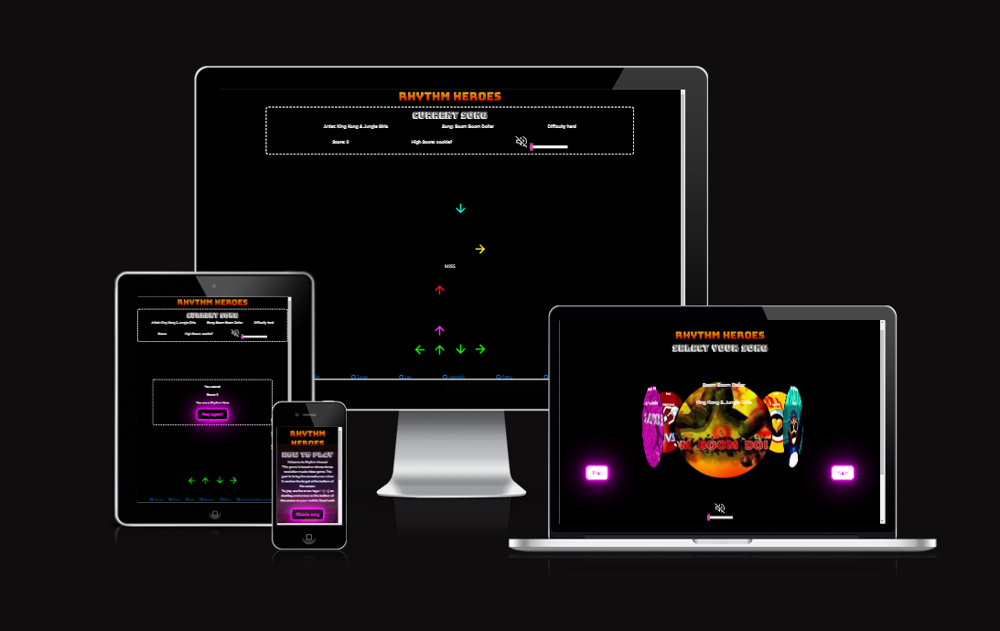
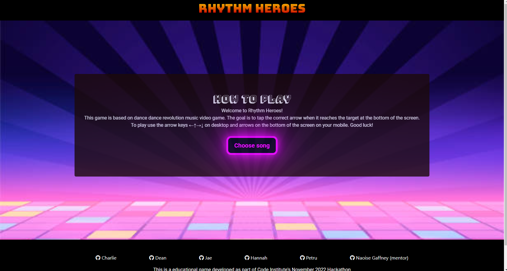
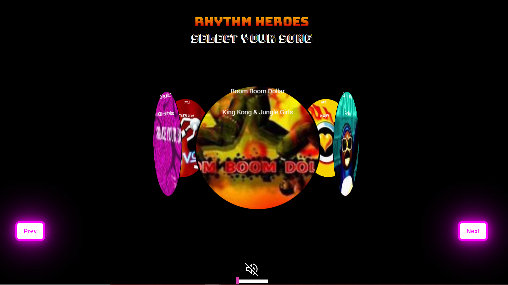
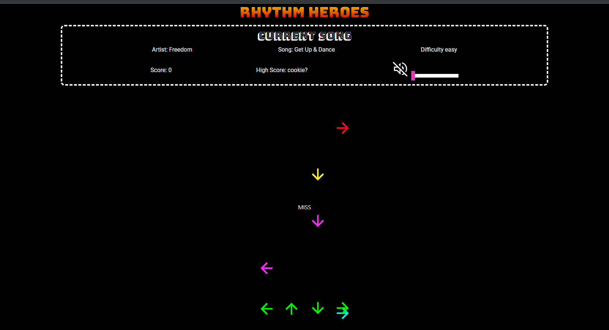
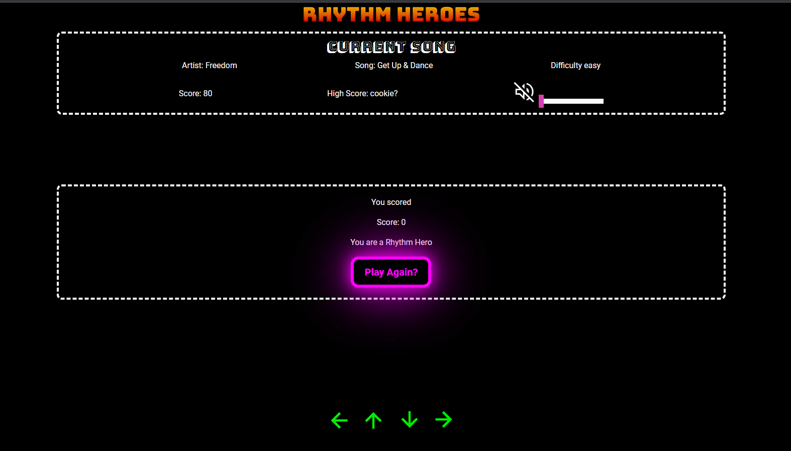

# **Rhythm Heroes** : *Hackathon Nov 2022*
## *GAME TAG LINE*



## Project Overview
Welcome to Rhythm Heroes!
This game is based on the retro Dance Dance Revolution arcade game. The goal of this game is to test your rhythm, your musical timing and your reflexes.


## How to play
First, select A song! Each song has a different difficulty level so choose wisely!
Once the game starts, you will see directional arrows sliding down your screen at different speeds and intervals according to the rhythm of the song. The goal is to tap the correct arrow when it reaches the target at the bottom of the screen. If your timing is good, your score will increase.

On keyboards, use the arrow keys ←↑→↓ and on your mobile device, simply tap the correct target at the bottom of the screen.
Good luck!

## Setup

### Deployed link

[Click here to play!](charliemallon.github.io/hackathonHero/)

### How to install

1. Double click setup.exe
2. Follow onscreen instructions

## User Stories 

**Persona**: Gamer 

1. As a gamer I am presented with the landing page which gives me a general overview of
   how to play the game. 

**Aceptance criteria**: Gamer was able to landing page with instructions.

 
2. As a gamer, I want to be presented with the start game button
   so that I can press the start game button to play the game. 

   **Acceptance criteria**: Gamer was able to click the start game button and play.

3. As a gamer, I want to be able to choose from a selection of song options and difficulty levels.

   **Acceptance criteria**:  Gamer was able to choose from a selection of songs.



4. As gamer, I want to be able to hear a snippet of the song audio before I make a song selection.

   **Acceptance criteria**: Gamer was able to hear the audio of each song before making a selection.


5. As a gamer, I want to see the gameboard, moving arrows and the arrow targets at the bottom of the screen.

   **Acceptance criteria** : Gamer was able to see all the elements of the gameboard, including the score, the track details and volume controls.



6. As a gamer, I want the option to play again at the end of the game

  **Acceptance criteria** :  Gamer was shown a play again button which, when pressed, directed them back to the carousel to select a new song and play again.

  


## Wireframes:

Some styling changes were made to the carousel and we decided against the split screen desktop deisplay for the game board, but the overall design for each page is consistent with the wireframes here.

  * [**Landing page**](assets/images/wireframes-carousel.png)
  * [**Carousel**](assets/images/wireframes-carousel.png)
  * [**Game-board**](assets/images/wireframes-gameboard.png)

# Testing

## Responsive Design
[Chrome Developer Tools](https://developer.chrome.com/docs/devtools/) and [Pesticide Chrome extension](https://chrome.google.com/webstore/detail/pesticide-for-chrome-with/neonnmencpneifkhlmhmfhfiklgjmloi) was regularly used during development to test responsiveness on different  screen sizes.
To make the website responsive [Bootstrap 4](https://getbootstrap.com/docs/4.0/getting-started/introduction/) and CSS was used.
Responsiveness for different screen sizes can be seen in the features section above.

## Validator Testing

## Deployment

 * We have used Gitpod an IDE to write the  game code.

 * Team worked on each task by making a fork of the original copy of the repo.

 * Team created a branch name and add individual work to the project repo using ```git add command```.

 * A pull request is created and added to the project logs.
   
 * The project lead reviewed and approved the pull request and merged to the project repository.


## Technologies used

- [HTML5](https://en.wikipedia.org/wiki/HTML5) for the contents and structure of the website.
- [CSS3](https://en.wikipedia.org/wiki/CSS) for the styling and animations.
- [Bootstrap 4](https://getbootstrap.com/docs/4.0/getting-started/introduction/) for responsive design
- [Balsamiq](https://balsamiq.com/) for wireframes.
- [GitHub](https://github.com/) as a remote repository.
- [gitpod.io](https://www.gitpod.io) was used as IDE and  git version control.
- [Chrome Developer Tools](https://developer.chrome.com/docs/devtools/) for testing screen sizes and using
- [Wave Chrome extension](https://wave.webaim.org/) to check web accessibility.
- [Pesticide Chrome extension](https://chrome.google.com/webstore/detail/pesticide-for-chrome-with/neonnmencpneifkhlmhmfhfiklgjmloi) during development.
- [Game name generator](https://anytexteditor.com/game-name-generator).
* [Downie 4](https://software.charliemonroe.net/downie/) to download YouTube videos for playlist.
* [Permute](https://software.charliemonroe.net/permute/) to convert downloaded YouTube videos, from mp4 to mp3.
* [amiresponse](https://ui.dev/amiresponsive?url=https://charliemallon.github.io/hackathonHero/game.html?songIndex=1)


## Credits
Project idea took inspiration from the following sources:
* [How to Make a DANCE DANCE REVOLUTION](https://www.youtube.com/watch?v=fJFZZ6MlgLE) 


* [Animation](http://www.javascriptkit.com/javatutors/requestanimationframe.shtml)
* [CSS filter generator to convert from black to target hex color](https://codepen.io/sosuke/pen/Pjoqqp)
* [Youtube - Dance Dance Revolution Playlist ](https://www.example.com)
* [CSS Neon button effect](https://www.lenastanley.com/2022/01/css-neon-button-neon-effect.html?m=1) for the button styles.


## Contributors

* [Charlie Mallon](https://github.com/CharlieMallon)
* [Dean Dodds](https://github.com/DeanDodds)
* [Hannah Carey](https://github.com/HPCarey)
* [Jae Phillips](https://www.example.com)
* [Petru Chelban](https://github.com/petrugio)

## Acknowledgements

To all the Rhythm Hero game developers, your time and contributions are highly valued. Thank you.
To our Facilitator- Naoise Gaffney, thank you for your support and checkpoints.